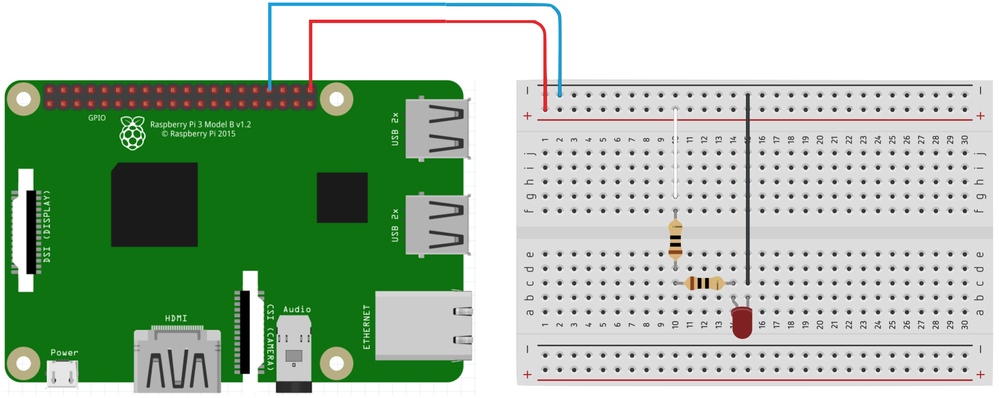
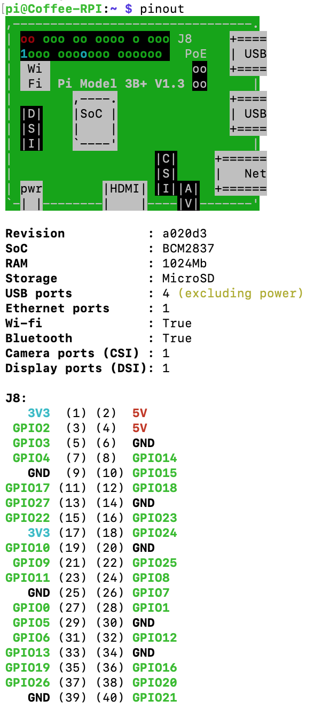
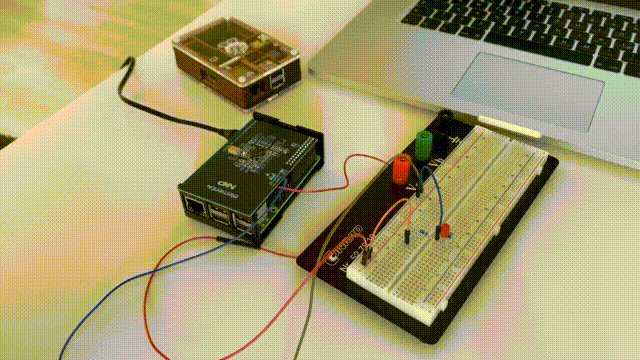

# NFC-RFID-RPi

# In General 
* * [Raspberry Pi 3 Model B Plus Rev 1.3](https://www.unixtutorial.org/command-to-confirm-raspberry-pi-model)
* Expansion Board: NXP PNEV512R EXPLORE-NFC
* * [overview at NXP (offical download site)](https://www.nxp.com/products/rfid-nfc/nfc-hf/nfc-readers/explore-nfc-exclusive-from-element14:PNEV512R)
* * [buy at element14](https://www.element14.com/community/docs/DOC-71574)

# Ressources overview
[Download Link for Ressources (NXP)](https://www.nxp.com/products/rfid-nfc/nfc-hf/nfc-readers/explore-nfc-exclusive-from-element14:PNEV512R)
|Ressource              | Description 	| relevance  	|  	
|---	                        |---	|---
| AN11802.pdf  	|NFC Reader Library for Linux Installation Guidelines. Step-by-Step guide inlc. lots of examples  	| **top priority**
| ReadmeNFC-LIB.txt  	| Read me of NFC Reader Library (sw3693.zip) 	| **top priority**
| NFC Reader Library .deb file  	| .deb is necessary to install in any case | **top priority**   
| sw3693.zip  	| Software for AN11802.pdf|  **top priority** 
| AN11480.pdf  	| Quick Start-Up Guid for EXPLORE-NFC working with Raspberry Pi (**non programmable, only executable!**) 	| optional   	  	
| SW2827.pdf  	| Software for Quick-Start (AN11480.pdf)   	| optional   
| [Video Tutorial of AN11480.pdf](https://www.nxp.com/video/explore-nfc-near-field-communication-for-the-raspberry-pi-video-startup-guide:EXPLORE-NFC-RASPBERRY-PI) | Video-Tutorial of quick-start guide | optional  optinal
| [NXPPY (Github Repo)](https://github.com/svvitale/nxppy)  	| Python wrapper for interfacing with the NXP EXPLORE-NFC shield for Raspberry Pi	| optional   
| [NDEFLIB (Github Repo)](NXP-Documentation/)  	| Python package for parsing and generating NFC Data Exchange Format messages. 	|  optional
| NTAG213_215_216.pdf  	| NFC Type 2 Tag compliant IC with 144/504/888 bytes user memory. NFC Sample card of the Reader| nice to know   
| PN512.pdf  	|IC of NFC Reader PCB| nice to know   
| AN11276.pdf  	| NTAG Antenna Design Guide + Design of 13.56 MHz Stickers (Research Paper) (incl. example files) | nice to know   	  	
| OT344310 folder   	| BOM + Schematics	| nice to know   
| SW282911 | Card Emulation example for the Raspberry Pi. Emulates a Type 2 Tag. |   optional	  	

# Main Approach
* Install Raspbian (git-core is already included)
* Install [WiringPi](https://tutorials-raspberrypi.de/wiringpi-installieren-pinbelegung/). Be Careful: the repo of Drogon is not available anymore, so please use [this repo for WiringPI](https://github.com/WiringPi/WiringPi)
* * To compile a C-File with including WiringPi, you must run the following command `gcc blink.c -o blink -l wiringPi` 
* Install everything according to AN11802.pdf
* * According to AN11802.pdf , the NFC Reader Library is built by CMake
* Folder [NFC-Reader](NFC-Reader/) contains the unzipped sw3693 files
* * Create a subdirectory *Example1_incl_WiringPi* and add the following in the [global CMakeList](NFC-Reader/CMakeLists.txt):   `ADD_SUBDIRECTORY(Example1_incl_WiringPi)`
* * Set-up project dependend CMakeList like shown: [CMakeLists.txt](NFC-Reader/Example1_incl_WiringPi/CMakeLists.txt)
* * * Manual to integrate WiringPi with Cmake can be found [here](https://stackoverflow.com/questions/30424236/add-wiringpi-lib-to-cmake-on-raspberrypi/33357636#33357636)
* Add GPIO specific actions in [Example1_incl_WiringPi.c](NFC-Reader/Example1_incl_WiringPi/Example1_incl_WiringPi.c) 
* * `#include <wiringPi.h>`
* * `#include <stdio.h>`
* * `#define  LED   21` **be careful: BCM numbering is used, so the name of the pin meant is: GPIO21**
* * lookup pins via the shell command `pinout` 
* * the `blink_led()` GPIO function is inserted for the following conditions: `else if((status & PH_ERR_MASK) == PHAC_DISCLOOP_DEVICE_ACTIVATED)`, so right after a card is detected
* Declare the new function *blink_led(void);* within the header ([Example1_incl_WiringPi.h](NFC-Reader/Example1_incl_WiringPi/intfs/Example1_incl_WiringPi.h), so that no *warning: implicit declaration of function* appears) 

## Execution 
* `cd /NFC-Reader/_build/`
* * `cmake ..`
* `cd /_build/Example1_incl_WiringPi.c`
* * `make`
* * `./Example1_incl_WiringPi.c`

## Wiring 
### Schematic of Raspberry Pi - LED Wiring 
* Raspberry Pi GPIO Pin (UGPIO= 3,3V)
* Red LED (UF = 2V)
* Resistors 2x 10Ω

### Pin Numberbing
* Command: `pinout`
* BCM-Numbering: the number after GPIO<BCM-Number>. In this case pin (40) aka GPIO21 is used in c-File

## Result

[Full video with NFC and RFID](misc_media/nfc-led-blink.mov)

# Miscellaneous 

## Example Responses of NFC and RFID
[Text file of the responsoses of a NFC-Card, RFID-Card and RFID-Chip](misc_media/responses-nfc-rfid.txt)

## NFC related Paspberry Pi projects 
* [Element14 Blog: NFC: Projektvorstellung (2014)](https://www.element14.com/community/community/raspberry-pi/raspberry-pi-bplus/blog/2014/09/08/pi-passport-projektvorstellung)

* [NXP Co-Worker on github](https://github.com/michaelneurohr)
* * [Problem](https://github.com/svvitale/nxppy/issues/24)

## Installation according to quick-start Guide
* AN11480.pdf or [NXP: NFC Video Tutorial](https://www.youtube.com/watch?v=kbt4LFZptPk)
* * [Download Link for PNEV512R](https://www.nxp.com/products/rfid-nfc/nfc-hf/nfc-readers/explore-nfc-exclusive-from-element14:PNEV512R)
* * Be careful with the download file (latest and correct file is SW2827.zip) 
* * *Neard EXPLORE-NFC - Using NeardAL with EXPLORE-NFC. This package contains all software packages to get started working with the EXPLORE-NFC on the Raspberry Pi using the Raspbian Wheezy or Jessie image. (REV 1.6 )* 
* *  ... **using the Raspian Wheezy or Jessie**!
* ( [NXP Starting Guide](https://www.nxp.com/video/explore-nfc-near-field-communication-for-the-raspberry-pi-video-startup-guide:EXPLORE-NFC-RASPBERRY-PI) )

#### Demo with NFC Sample Card
* go to explore-nfc folder `cd explore-nfc`
* type in: `explorenfc-basic -k`

## Installation of nxppy (Github)
* **only if you are more comfortable with pyhton **
* follow instructions of [NXPPY Github Repo](https://github.com/svvitale/nxppy), which are:
* Login at NXP and download **NFC Reader Library for Linux V4.010.03.001609**
* again: read carefully - the filename of the download should be: **NFC-Reader-Library-4.010-2.deb**

* * `sudo apt-get update`
* * `sudo apt-get install build-essential cmake python3-dev python2.7-dev`
* * `sudo dpkg -i NFC-Reader-Library-4.010-2.deb`
* Enable SPI: `raspi-config`
* `pip install nxppy`
* Download the [NXPPY](https://github.com/svvitale/nxppy) Git Repo itself
* * within the files of the repo execute the command: `sudo python setup.py build install`

* Addionally download [ndeflib Github Repo](https://github.com/nfcpy/ndeflib) for the ability to parse and generate messages according to the NFC Data Exchange Format (NDEF)
* * within the files of the repo execute the command: `sudo python setup.py build install`

